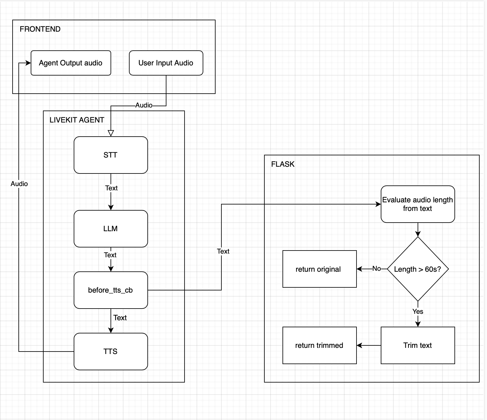

# Chi-Jarvis

Chi-Jarvis is a voice assistant system built on LiveKit's agent framework with a microservice architecture. It enables natural voice conversations through an AI-powered pipeline that handles voice detection, speech-to-text conversion, language processing, and text-to-speech generation.

## System Architecture

The system consists of three main components:

1. **Voice Agent**: Handles voice interactions using LiveKit's agent framework
2. **Backend Service**: Flask-based API for processing and validating responses
3. **Frontend**: Web interface for user interaction



## Project Origins

This project was bootstrapped using LiveKit templates:

- **Agent**: Created using `lk app create --template voice-pipeline-agent-python`
- **Frontend**: Created using `lk app create --template voice-assistant-frontend`
- **Backend**: Custom Flask service for extended functionality

## Features

- Real-time voice interaction
- Speech-to-text processing via Deepgram
- Natural language processing via Google's Gemini 2.0 Pro
- Text-to-speech via Cartesia
- Voice activity detection using Silero
- Response length validation to ensure natural voice responses
- Metrics collection for system monitoring

## Prerequisites

- Docker and Docker Compose
- API keys for:
  - [Google API (Gemini 2.0 Pro)](https://aistudio.google.com/app/apikey)
  - [Cartesia API](https://cartesia.ai)
  - [Deepgram API](https://deepgram.com)
  - [LiveKit API](https://livekit.io)

## Environment Setup

Create a `.env` file in the project root with the following variables:

```
# LiveKit Configuration
LIVEKIT_API_KEY=your_livekit_api_key
LIVEKIT_API_SECRET=your_livekit_api_secret
LIVEKIT_URL=your_livekit_url

# AI Service Keys
GOOGLE_API_KEY=your_google_api_key
CARTESIA_API_KEY=your_cartesia_api_key
DEEPGRAM_API_KEY=your_deepgram_api_key
```

## Installation and Running

1. Clone the repository:
   ```bash
   git clone https://github.com/MuzykaAndrii/jarvis
   cd chi-jarvis
   ```

2. Start the services:
   ```bash
   docker-compose --env-file .env up --build -d
   ```

3. Access the frontend at `http://localhost:3000`

## Project Structure

```
chi-jarvis/
├── agent/                 # Voice assistant agent
│   ├── app/               # Agent application code
│   │   ├── common/        # Shared utilities
│   │   ├── loggers/       # Logging configuration
│   │   ├── prompts/       # LLM prompts
│   │   └── validator/     # Response validation
│   ├── Dockerfile         # Agent container definition
│   ├── main.py            # Agent entry point
│   └── pyproject.toml     # Dependencies
├── backend/               # Flask backend service
│   ├── app/               # Backend application code
│   │   ├── audio/         # Audio processing modules
│   │   └── main.py        # Flask app definition
│   ├── Dockerfile         # Backend container definition
│   └── pyproject.toml     # Dependencies
├── frontend/              # Web frontend
└── docker-compose.yaml    # Service orchestration
```

## Backend API

### Endpoints

- `POST /audio/validate`: Validates the length of LLM-generated text to ensure it doesn't exceed maximum audio duration
  - Request body: `{ "text": "LLM generated text" }`
  - Response: `{ "text": "Validated text (possibly truncated)" }`

## Faced problems and limitations

### API Rate Limits

- **Gemini Free Tier Interruptions**: The system uses Google's Gemini 2.0 Pro which has rate limits on the free tier (5 requests per minute). If you encounter interruptions during conversations:
  - Wait approximately 1 minute
  - The conversation can be continued afterward
  - Consider upgrading to a paid tier for production use
  - **Alternative Solution**: Better to host your own LLM using Ollama with open-source models like DeepSeek to overcome the free tier limitations. This requires modifying the agent's LLM configuration from Google's Gemini to a locally-hosted model.

### Performance Considerations

- **Frontend Initial Load**: The first request to the frontend may take up to 30 seconds due to Next.js SWC compilation in development mode
  - This is only an issue in development, not in production builds
  - Subsequent loads will be faster as compilation results are cached

### Build Process Limitations

- **Missing Turn Detector Plugin**: The `livekit-plugins-turn-detector` was removed from the project due to issues with downloading additional files during the Docker build process
  - This may affect turn-taking capabilities in conversations
  - Consider implementing alternative turn detection if needed
